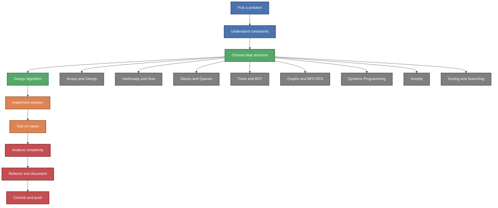

# algorithms-practice - Algorithm & Data Structure Challenges

📌 **Personal Practice Repository – Algorithmic Problem Solving & Coding Interview Prep**

## ▌ Description

This repository contains my **personal solutions** to algorithm and data structure problems, mostly written in **Python** and **C/C++**.  
The goal is to **strengthen problem-solving skills**, prepare for **coding interviews**, and reinforce **computer science fundamentals**.

Problems are inspired by platforms like **LeetCode**, and other online judges.



## ▌ Repository Status 📈

### ■ **Organized by platform and topic**  
▸ LeetCode solutions (Python)  
▸ Custom logic exercises for learning and experimentation  

### ■ **Actively maintained**  
▸ New problems added regularly  
▸ Solutions are being reviewed and optimized  
▸ Comments and explanations are in progress

⚠ This is a **learning repository** – some solutions may be in progress or marked for improvement.

## ▌ Objectives

✔ Improve algorithmic thinking  
✔ Prepare for technical interviews  
✔ Practice data structures (lists, trees, graphs, stacks, etc.)  
✔ Explore time and space complexity  
✔ Learn to write clean, readable, and efficient code  

## ▌ How to Use

### ■ **Clone the repository**
```sh
git clone https://github.com/ai-dg/algorithms-practice.git
cd algorithms-practice
```

### ■ **Explore folders**
Each folder represents a different platform or topic.
Inside, you’ll find:

The problem description (if needed)

The code solution

Sometimes, notes or explanation files

### ▌ **Technologies Used**
▸ Languages: Python, C, C++
▸ Tools: VSCode, g++, Python3 CLI
▸ Platforms: LeetCode, custom challenges

## 📜 **License**
This repository is open for learning and collaboration.
If you use these solutions for practice, feel free to contribute improvements or explanations.
Avoid direct copy-pasting for assignments or schoolwork – understanding comes first!

